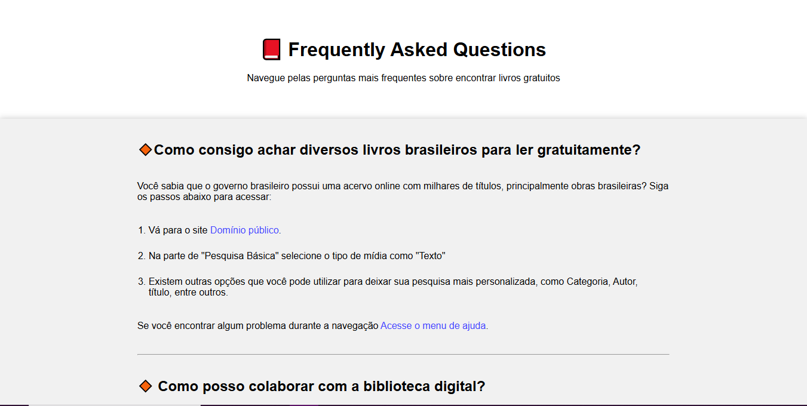

<!-- Please update value in the {}  -->

<h1 align="center">{FAQ sobre onde encontrar livros} | devChallenges</h1>

   Solution for a challenge <a href="https://devchallenges.io/challenge/simple-faq-challenge" target="_blank">Simple FAQ</a> from <a href="http://devchallenges.io" target="_blank">devChallenges.io</a>.

  <h3>
    <a href="https://eric-l-araujo.github.io/faq-simples-livros/">
      Demo
    </a>
     | 
    <a href="https://your-url-to-the-solution](https://devchallenges.io/solution/51222">
      Solution
    </a>
     | 
    <a href="https://devchallenges.io/challenge/simple-faq-challenge">
      Challenge
    </a>
  </h3>

<!-- TABLE OF CONTENTS -->

## Table of Contents

- [Overview](#overview)
- [What I learned](#what-i-learned)
- [Built with](#built-with)
- [Features](#features)
- [Author](#author)

<!-- OVERVIEW -->

## Overview

<!--  -->

<!--
Introduce your projects by taking a screenshot or a gif. Try to tell visitors a story about your project by answering:

- What have you learned/improved?
- Your wisdom? :)
-->

### What I learned

Consegui utilizar o HTML5 com tags semânticas e a organizá-las de acordo com o conteúdo. Aprendi a utilizar as regras CSS aplicando estilos nos elementos HTML. Além disso,  consegui implementar responsividade no site utilizando media queries, incluindo as boas práticas do Mobile-First Approach.

### Built with

<!-- This section should list any major frameworks that you built your project using. Here are a few examples.-->

- Semantic HTML5 markup
- CSS custom properties
- Flexbox

## Features

<!-- List the features of your application or follow the template. Don't share the figma file here :) -->

This application/site was created as a submission to a [DevChallenges](https://devchallenges.io/challenges-dashboard) challenge.

## Author
- GitHub [@Eric-L-Araujo](https://github.com/Eric-L-Araujo)
